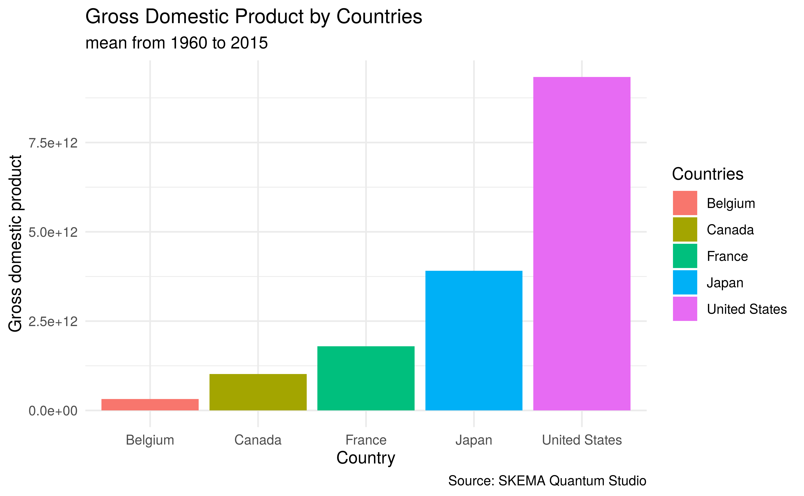
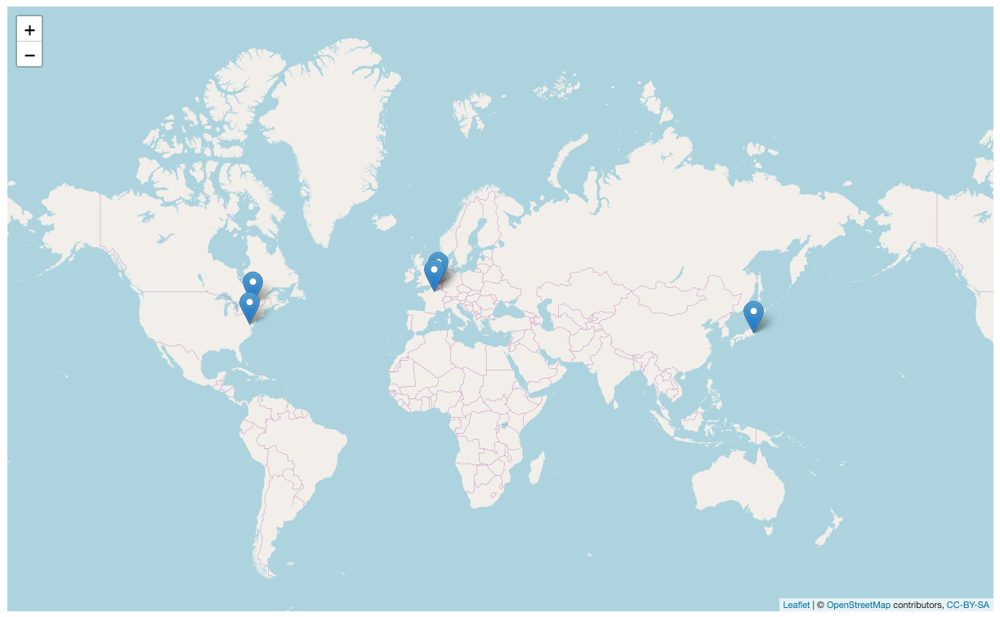

```{r setup, include=FALSE}
knitr::opts_chunk$set(echo = TRUE)
```

# Import data

You need to import this dataset to do this mission impossible 3.

```{r}
library(readr)
gdp5 <- read_csv("./data/mi3DataGdp5.csv")
gdp5$X1 <- NULL
```

# Computing Summary Statistics 

Calculate the mean gdp per country using the gdp5.

```{r}
gdp6 <- 
```

# Create a bar chart 

Recreate the following bar chart.



```{r}
library(ggplot2)

```

# Create a map

Use the gdp7 to recreate the following map.



```{r}
library(gsheet)
library(dplyr)
locations <- gsheet2tbl("https://docs.google.com/spreadsheets/d/1VUxLOL2GH2ULrZ-lqQUa5IPKeSH-4dy_hTevZUyqbv4/edit#gid=0")
colnames(locations)[1] <- "country"
gdp7 <- left_join(gdp6, locations, by = "country")
```

```{r}
library(leaflet)

```


